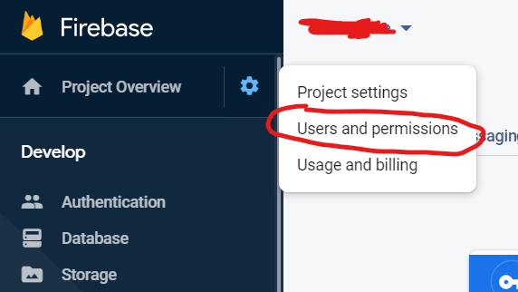
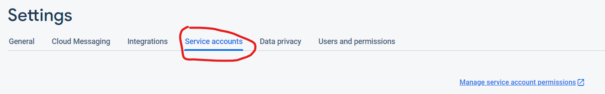
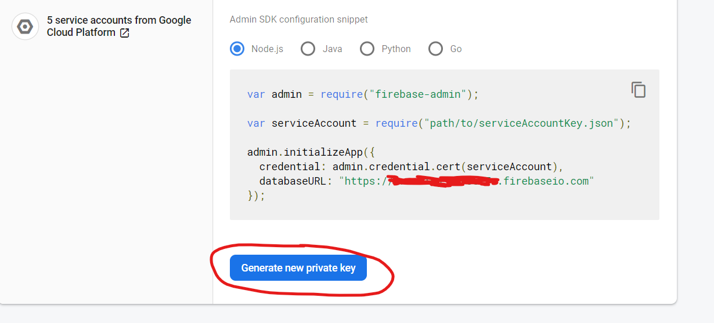

# Getting Started

1.  Clone the repo.
2.  Create a new firebase project at https://firebase.google.com/
3.  From inside of firebase navigate to `Users and Permissions` then `Service Accounts`.

;

4.  Then navigate to service accounts

;

5.  Then click `Generate new private key` and save to the root of this repo as `serviceAccountKey.json`.

;

6.  Populate the upload folder with any json you want to see uploaded to firestore. 


Feel free to use this code however you wish.  Perhaps you have some CSV file you need to transform into JSON to insert into firestore.  I'm needing to do this.  There are several libraries out there for transofming CSV into JSON.  I will be including implemenations of this once I have finished them.  


## Things to note!

* If you use the uuid package here then a new record will get generated everytime you upload to firestore even if one already exists with exactly the same data.  You might want this but in cases where you would rather a duplicate not be created and an update of the existing record should occurr determine a key common to your data set.  Perhaps something like `obj.id` or `obj.name` but this will depend on the data you are importing.

* This uploader assumes that you are uploading an array of objects in each file.  If you attempt to upload a single JSON object in a file you will get an error.  If you must only upload a single object then do so inside an array. 

* The only thing that has to common among the objects you send is a key and that is only if you are using one.  The beauty of a NOSQL Document database is that you don't have your data match any particular schema.  Might be a good idea if it did but the uploader doesn't care if the shape is different across objects.  

```json
[ 
    { "name":"Batman", "age":42, "city":"Gotham"}
]
```

Happy Coding!